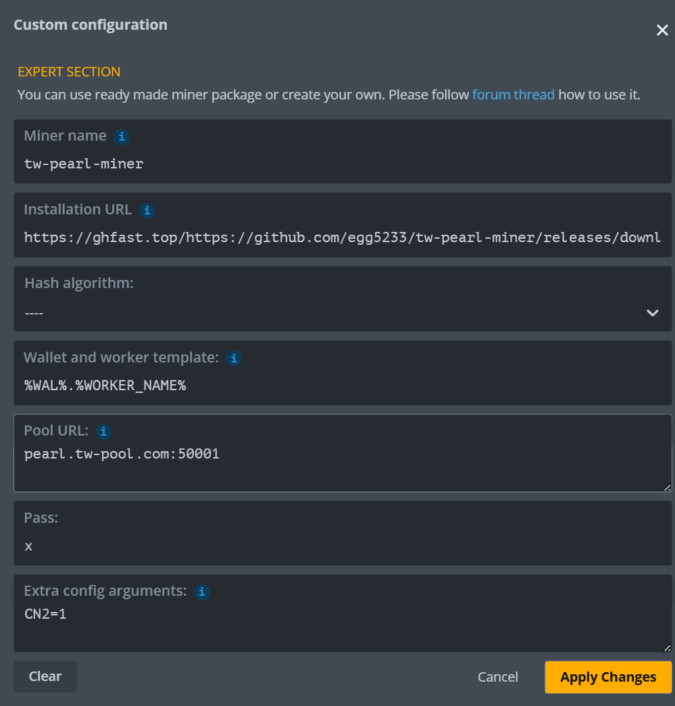

# tw-pearl-miner on HiveOS

**English** | [简体中文](README.zh-CN.md) | [繁體中文](README.zh-TW.md)

A HiveOS **Custom Miner** package for the Pearl GPU miner. Works on any Ampere-or-newer NVIDIA GPU
(RTX 30/40/50, A100, H100).

> **2.0.0 change:** there is **no built-in pool** — you set your mining pool in the **Pool URL** field
> (required), and **Extra config arguments** are now miner **CLI flags** (e.g. `--gpus 0,1`), not
> environment variables. See *Migrating from 1.x* below.

## Quick start — import a Flight Sheet (JSON)

Want to skip the manual setup? Add a **PRL wallet** first (Wallets → add your `prl1...` address), then
import the Flight Sheet JSON below (HiveOS → **Flight Sheets** → import / paste). It already wires up
the custom miner, install URL, algo and a pool — you only confirm the wallet and, optionally, change
the pool.

```json
{
    "isFavorite": false,
    "items": [
        {
            "coin": "PRL",
            "dpool_ssl": false,
            "miner": "custom",
            "miner_alt": "tw-pearl-miner",
            "miner_config": {
                "algo": "pearlhash",
                "install_url": "https://github.com/egg5233/tw-pearl-miner/releases/download/v2.0.5/tw-pearl-miner-2.0.5.tar.gz",
                "miner": "tw-pearl-miner",
                "pass": "x",
                "template": "%WAL%.%WORKER_NAME%",
                "url": "hk.pearl.herominers.com:1200"
            },
            "pool_geo": [],
            "pool_ssl": false,
            "wal_id": 0
        }
    ]
}
```

- **`wal_id`** references your HiveOS wallet (`0` = your first PRL wallet); `%WAL%` expands to that
  payout address and `%WORKER_NAME%` to the rig name.
- **`url`** is the pool — the example uses herominers HK (`hk.pearl.herominers.com:1200`). Change it to
  your own pool; for TLS or another transport add a scheme as described in *Pool URL* below.
- **`install_url`** pins **v2.0.4** — bump it to the latest release tag when a newer version ships.

Prefer to set it up by hand? Follow the steps below.

## Install

1. In HiveOS, open your worker → **Flight Sheets** → create a new flight sheet (or **Wallets** first).
2. **Add a Custom Miner** (Flight Sheet → Miner → `+` → *Setup Miner Config* → **Custom**):
   - **Miner name:** `tw-pearl-miner`
   - **Installation URL:**
     ```
     https://github.com/egg5233/tw-pearl-miner/releases/download/v2.0.5/tw-pearl-miner-2.0.5.tar.gz
     ```
     (or `https://github.com/egg5233/tw-pearl-miner/releases/latest/download/tw-pearl-miner-2.0.5.tar.gz`)
   - **Hash algorithm:** `pearl` (free text — informational only)
3. Fill the flight-sheet fields:
   | Field | Value |
   |-------|-------|
   | **Wallet and worker template** | your `prl1...` payout address (or `prl1....%WORKER_NAME%`; a `.worker` suffix becomes the worker name) |
   | **Pool URL** | **REQUIRED** — your pool's `host:port`, or with an explicit transport scheme (see below) |
   | **Pass** | `x` |
   | **Extra config arguments** | *(optional)* extra miner **CLI flags**, e.g. `--gpus 0,1` (see *Extra config* below). **Not** environment variables. |
4. Apply the flight sheet. HiveOS downloads the package to `/hive/miners/custom/tw-pearl-miner/` and
   starts mining.



*HiveOS flight-sheet reference — Custom configuration: miner name, installation URL, wallet template,
**Pool URL** (e.g. `stratum+ssl://hk.pearl.herominers.com:1200`), Pass=`x`, and Extra config arguments
as CLI flags (e.g. `--gpus 0,1`).*

The rig name is taken automatically; hashrate (TH/s) and accepted/rejected shares show on the HiveOS
dashboard.

## Pool URL (required — scheme selects the transport)

The Pool URL is passed to the miner **verbatim**; the URL scheme decides how it connects:

| Pool URL | Transport |
|----------|-----------|
| `host:port` (bare) | a built-in **preset** pool (herominers / kryptex / luckypool) |
| `stratum+ssl://host:port` | TLS (certificate verified) |
| `stratum+tcp://host:port` | plaintext TCP |
| `stratum+ssl-insecure://host:port` | TLS without certificate verification (e.g. a relay / self-signed front, such as `stratum+ssl-insecure://<ip>:1200`) |

An arbitrary (non-preset) pool needs an explicit scheme. Example: `stratum+ssl://hk.pearl.herominers.com:1200`.

## Extra config = CLI flags

Whatever you put in **Extra config arguments** is appended to the miner command line verbatim
(SRBMiner-style), one or more flags separated by spaces or newlines. Examples:
- `--gpus 0,1` — mine only on GPU 0 and 1
- `--no-tui` — disable the full-screen TUI (HiveOS already runs headless; this is automatic under the
  log, so you rarely need it)

## Migrating from 1.x

- **Pool URL is now required.** 1.x used a built-in pool with the field left blank. Set your pool's
  `host:port` (with a scheme if it's not a preset). If you leave it blank the miner will not start and
  the log will tell you to set it.
- **Extra config is CLI flags, not env vars.** The old `POOL_TLS=0`, `CN2=1`, `PEARL_CN2=N`,
  `POOL_HOST=`, `NO_CPU=` style lines are **removed** and will be rejected with a migration message in
  the log. Use the Pool URL scheme for transport (e.g. `stratum+tcp://` instead of `POOL_TLS=0`), and
  pass real `--flags` for everything else.

## Package contents
```
tw-pearl-miner/
  pearl-gpu-miner       miner binary (fat: sm_80/86/89/90/120a + PTX)
  libpearlkernel.so     CUDA kernel
  libcudart.so.13       CUDA runtime
  h-manifest.conf       miner metadata (CUSTOM_VERSION=2.0.0)
  h-config.sh           flight sheet -> miner argv
  h-run.sh              launches the miner
  h-stats.sh            reports hashrate/shares to HiveOS
```

## Notes
- **GPU support:** Ampere or newer (needs SM80 int8 tensor cores). Pre-Ampere (GTX 10xx / RTX 20xx)
  is not supported.
- **Driver:** **≥ 580.65** (Linux) — a CUDA-13 capable driver. Upgrade in the HiveOS web UI
  (worker → ⋮ → *Upgrade* / NVIDIA driver) or run `nvidia-driver-update` in the Hive Shell. If the log
  shows `cudaGetDeviceCount returned 0` / `pk_init failed`, the driver is **too old** — `nvidia-smi`
  must report "CUDA Version: 13.0" or higher.
- **Stuck on a 570–580 driver (no CUDA 13)?** Use the **CUDA-12.8** package instead — same speed, runs
  on driver ≥ 570.26 (bundles `libcudart.so.12`):
  ```
  https://github.com/egg5233/tw-pearl-miner/releases/download/v2.0.5/tw-pearl-miner-2.0.5.c12.tar.gz
  ```
- **Hashrate units:** the miner reports TH/s; HiveOS scales it (`total khs` = `TH/s × 1e9`).
